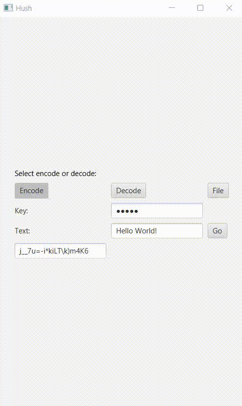
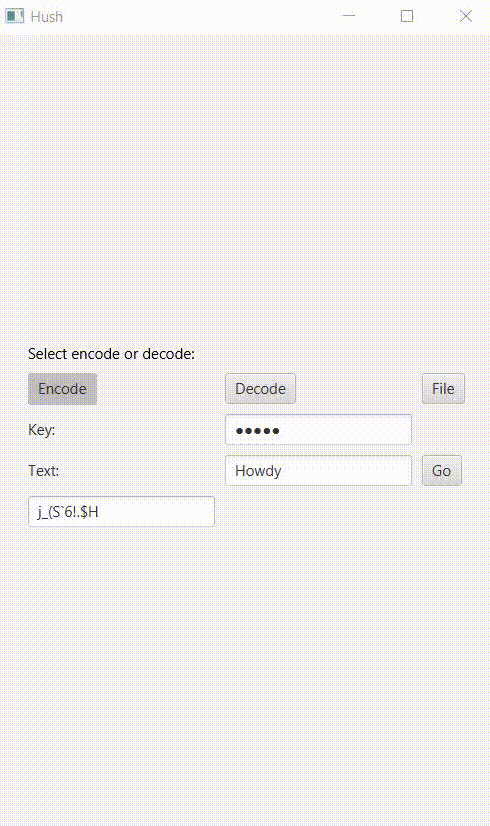
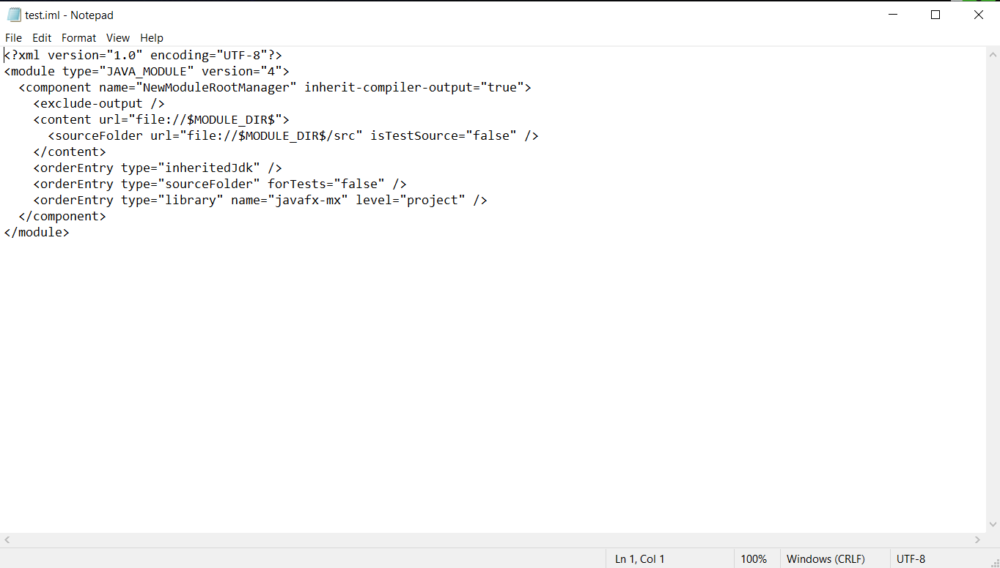
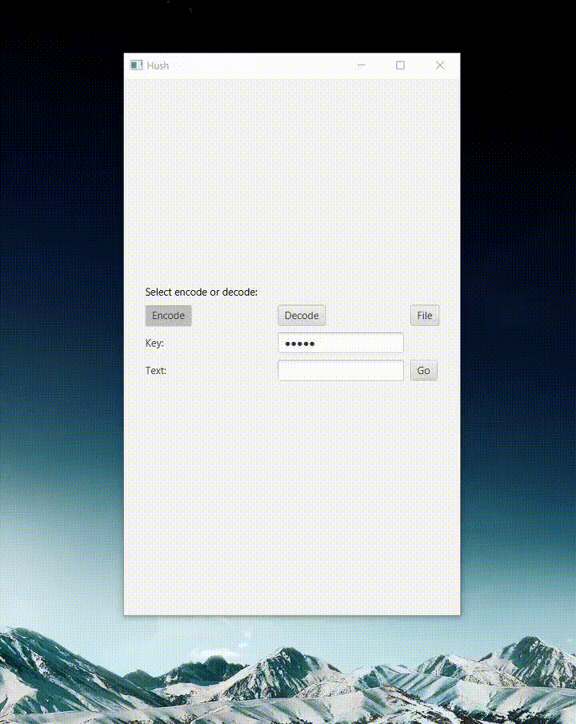
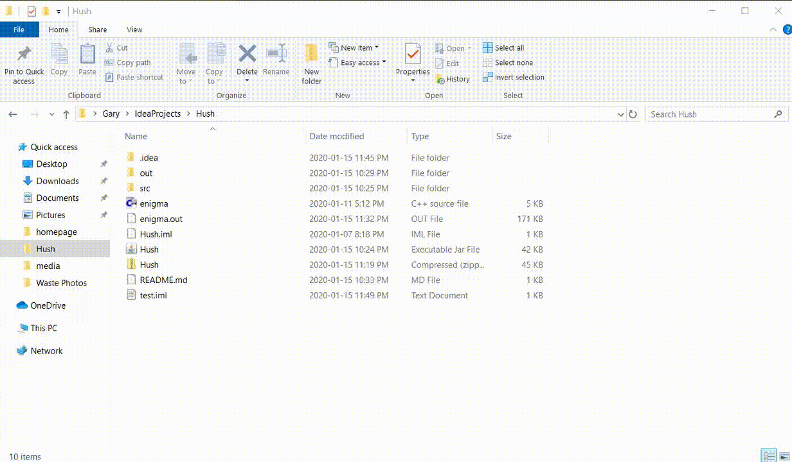
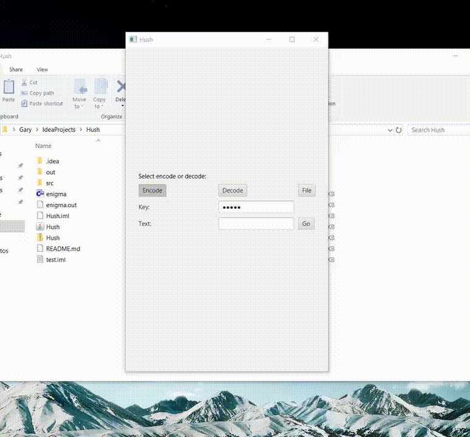
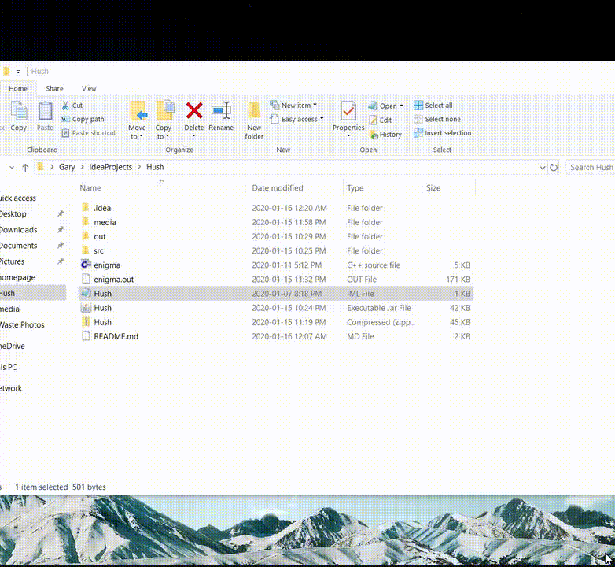

# Hush
Hush is a program that allows the user to encrypt their messages using OTP encryption. 

Simply encode your message, send the unreadable script to a peer, and have them decode it on their end. Such a technology was developed
by Claude Shannon and was notably used in WWII.

Choose any key that you wish, but do not reuse keys. Key reuse is a major security flaw that can lead to message leaks.

A jar is available to run the program.

Note: On first use of the application, please wait as it compiles the .exe file. 

Below is a demonstration:

Encoding:

Decoding:

For files:
For this example, we'll be using this .iml file created by my IDE (it follows markup convention)

First we'll select the file and with a key entered, we'll press go

Now a duplicate file will be found in Hush directory looking something like this.

The file has been encrypted! Now if we want to revert it, we just need to use the decode function...

There we go! The file has been decoded!

